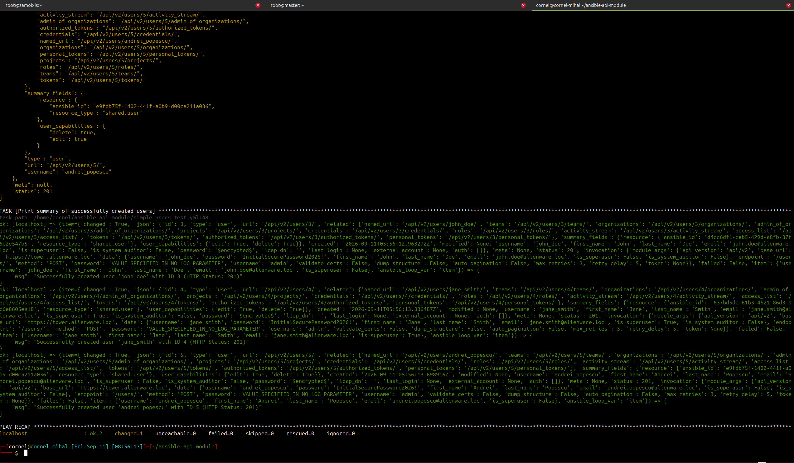

# `my_api` — Advanced Ansible REST API Module

**`my_api`** is a custom, lightweight Ansible module explicitly engineered to manage **REST API resources (GET, POST, PATCH, DELETE)** with a strong focus on enterprise orchestration platforms like AWX and Ansible Automation Controller. Unlike the default `ansible.builtin.uri` module, this utility abstracts out header repetitions, operates exclusively with **native JSON payloads**, manages structural loops dynamically, and includes built-in protective mechanics for robust execution flows.

---



---

## 🔥 Key Technical Features

* **Implicit JSON Handshake:** No manual dictionary conversions or header declarations required. Data payloads pass natively into the endpoint.
* **Smart Idempotency Pre-Checks:** Prior to executing a `PATCH` request, the module evaluates the server's state. If the properties match your desired state, the execution steps over cleanly with `changed=False`.
* **Safe Check Mode (Dry-Run):** Full support for the `--check` flag across all HTTP verbs, giving you accurate previews of what would be altered or created.
* **AWX Native Pagination:** Under `GET` requests, specifying `auto_pagination: true` parses `results` and steps along the dynamic path bound to the `"next"` key automatically.
* **Resilient Retry Loop:** Automatically catches transient networking metrics or cluster overhead errors (**HTTP 429 and 503**) and safely backs off before retrying the step.
* **Recursive Structure Analyzer:** Running `dump_structure: true` generates a schema breakdown containing the data types of nested response targets.

---

## 🛠️ Installation and Directory Alignment

To expose the module natively inside your playbook scopes, structure your local task environment repository as follows:

```text
.
├── library/
│   └── my_api.py
└── playbook.yml
```

---

## ⚙️ Module Parameter Specification

| Input Option | Type | Default Value | Functional Scope |
| :--- | :--- | :--- | :--- |
| **`base_url`** | `str` | *Required* | The root target server URL (e.g., `https://awx.alienware.loc`). |
| **`api_version`** | `str` | `"api/v2"` | Path context prefix inserted automatically. Set to `""` if the target path is absolute. |
| **`endpoint`** | `str` | *Required* | Path specific mapping (e.g., `/users/` or dynamic variables like `{{ user.related.teams }}`). |
| **`method`** | `str` | `"GET"` | Choice parameters restricted to: `GET`, `POST`, `PATCH`, `DELETE`. |
| **`token`** | `str` | `None` | Authentication string automatically embedded as a `Bearer Token`. |
| **`username`** | `str` | `None` | Identification string passing into standard `Basic Authentication`. |
| **`password`** | `str` | `None` | Secret key pairing for `Basic Authentication` (masked with `no_log`). |
| **`data`** | `dict` | `None` | Dictionary parameter representing raw parameters for payloads. |
| **`auto_pagination`**| `bool`| `false` | Loops dynamically across pagination properties for large lists. |
| **`dump_structure`** | `bool`| `false` | Discards values to instead map data type trees of the JSON nodes. |
| **`max_retries`** | `int` | `3` | Attempts to trigger if encountering 429/503 errors. |
| **`validate_certs`** | `bool`| `true` | Allows skipping verification checks for self-signed certificates. |

---

## 📝 Orchestration Examples

### 1. Loop Through and Create Multiple Users (POST)

```yaml
- name: Provision Multiple Team Members Natively
  my_api:
    base_url: "https://awx.alienware.loc"
    endpoint: "/users/"
    method: POST
    username: "admin_orchestrator"
    password: "SuperSecretAdminPassword"
    validate_certs: false
    data:
      username: "{{ item.username }}"
      password: "InitialTemporaryPassword2026!"
      first_name: "{{ item.first_name }}"
      last_name: "{{ item.last_name }}"
      email: "{{ item.email }}"
      is_superuser: false
  loop:
    - { username: "m_badea", first_name: "Mihai", last_name: "Badea", email: "mihai@alienware.loc" }
    - { username: "j_doe", first_name: "John", last_name: "Doe", email: "john@alienware.loc" }
```

### 2. Follow Hypermedia Relaunch Tokens (GET + Auto Pagination)

```yaml
- name: Collect All Relational Group Profiles Safely
  my_api:
    base_url: "https://awx.alienware.loc"
    api_version: "" # Cleared out because endpoint uses absolute paths
    endpoint: "{{ active_user_profile.json.related.organizations }}"
    method: GET
    token: "AbX4578291045aBdE"
    auto_pagination: true
    validate_certs: false
  register: organization_records
```

### 3. Safely Delete a Defunct Target Resource (DELETE)

```yaml
- name: Terminate Stale API Asset
  my_api:
    base_url: "https://awx.alienware.loc"
    endpoint: "/users/87/"
    method: DELETE
    token: "AbX4578291045aBdE"
    validate_certs: false
```
